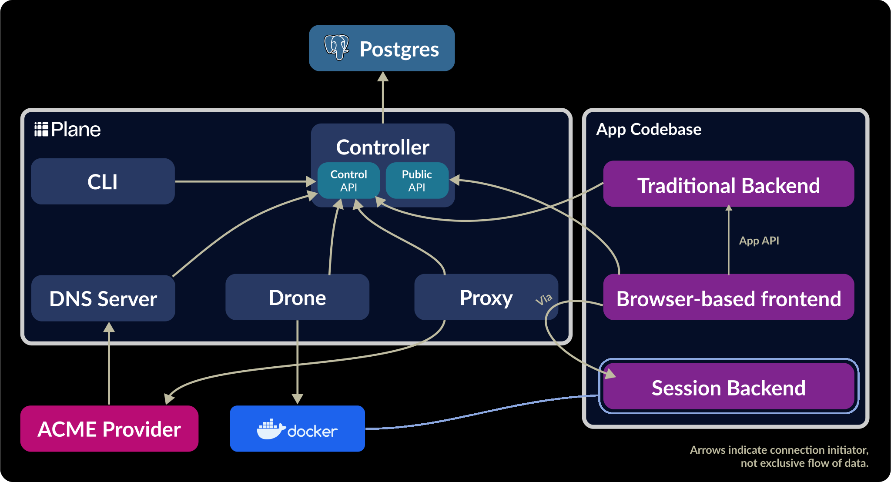

[Plane](https://plane.dev) is a distributed system for **running stateful WebSocket backends at scale**. Plane is heavily inspired by [Figma’s mulitplayer infrastructure](https://www.figma.com/blog/rust-in-production-at-figma/), which dynamically spawns a process for each active document.

Use cases include:
- Scaling up [authoritative multiplayer backends](https://driftingin.space/posts/you-might-not-need-a-crdt).
- Running isolated code environments (like REPLs, code notebooks, and LLM agent sandboxes).
- Data-intensive applications that need a dedicated high-RAM process for each active user session.

Read more about [Plane’s architecture](https://plane.dev/concepts/architecture).

